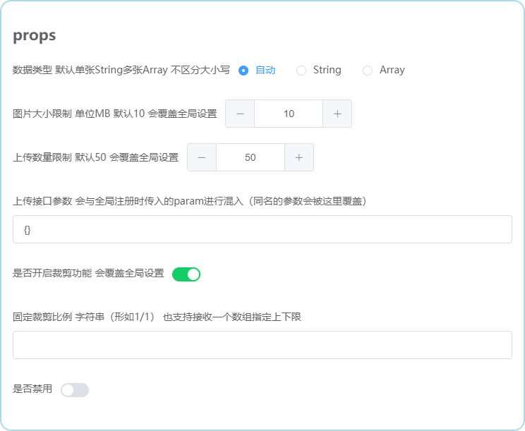

# imgpond / 图片上传池


<hr/>


<hr/>




### Features

- √ v-model双绑
- √ 支持上传前裁剪图片 可以固定裁剪比例、限定比例范围 
- √ 支持限制图片大小、限制上传数量
- √ 支持多选
- √ 支持拖拉拽改变排序（响应式）
- √ 灵活的数据类型：支持String/Array
- √ 支持上传后预览/禁用时预览
- √ 全局安装 通用参数仅需配置一次


### Installation
```
yarn add imgpond / npm i imgpond
依赖项：vue element-ui pic-viewer plain-kit

import Imgpond from 'imgpond'
Vue.use(Imgpond, { url: '接口地址' })
```


### Usage
请参考/demo中极简示例


### Notice
- 曾支持canvas图片压缩 但效果不理想 尤其对png不友好 图片压缩还是建议后端来做
- 图片格式目前写死支持jpg/jpeg/png 暂不提供配置
- 图片链接服务最好能够提供nginx跨域支持（推荐）
- 针对不支持跨域的情况 提供了localhost/线上的代理配置
