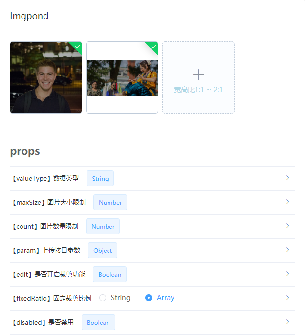
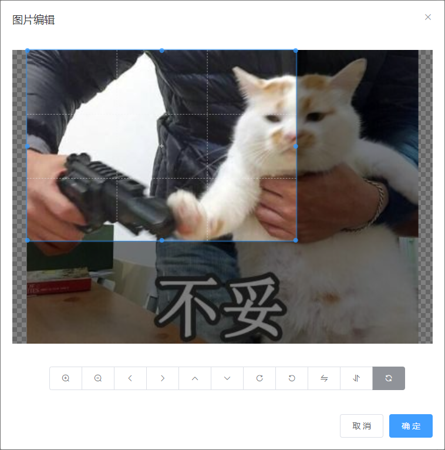

# imgpond / 图片上传池


<br/>



<br/>



<br/><br/>

### Features

- √ v-model双绑
- √ 支持上传前裁剪图片 可以固定裁剪比例、限定比例范围
- √ 支持限制图片大小、限制上传数量
- √ 支持多选
- √ 支持拖拉拽改变排序（响应式）
- √ 灵活的数据类型：支持String/Array
- √ 支持上传后预览/禁用时预览
- √ 全局安装 通用参数支持全局配置

<br/><br/>

### Installation

``` bash
$ yarn add imgpond
```

**Dependencies**：vue element-ui pic-viewer plain-kit

```js
import Imgpond from 'imgpond'
Vue.use(Imgpond, { url: '接口地址' })
```

<br/><br/>

### Quick Start

```html
<Imgpond v-model=""/>
```

| 参数 | 说明 | 配置方式 | 类型 | 可选值 | 默认值 |
| --- | --- | --- | --- | --- | --- |
| value / v-model | 双绑 | props | String / Array[String] | | |
| fixedRatio | 固定裁剪比例 | props | String（形如1/1） / Array（形如['1/1', '2/1']） | | undefined（不作限制） |
| fixedRatioDeviation | 固定裁剪比例误差范围（默认在＜±10%时不裁剪直接上传） | 全局 | Number | | 0.1 |
| valueType | 数据类型 | props | String | 'String' / 'Array'（不区分大小写） | undefined（自动，单张String多张Array） |
| request | axios实例 | 全局 | Axios | | |
| requestConfig | axios配置 | 全局 | Object | | *详见下方说明 |
| url | 上传接口地址 | 全局 | String | | |
| maxSize | 图片大小限制（单位MB） | 全局，props | Number | | 10 |
| count | 数量上限 | 全局，props | Number | | 50 |
| param | 上传接口参数补充 | 全局，props | Object | | { file: '二进制文件' } |
| edit | 是否开启裁剪功能 | 全局，props | Boolean | | true |
| disabled | 是否禁用 | props | Boolean | | false |
| poweredBy | 底层库（如果存在跨域困扰 建议使用'element'） | 全局 | String | 'filepond', 'element' | 'filepond' |
| key | 接口参数/返回值格式配置 | 全局 | Object | | *详见下方说明 |
| localProxy | 本地代理（针对filepond） | 全局 | Object | | |
| proxy | 代理（针对filepond） | 全局 | Object | | |

<br/><br/>

requestConfig

默认值：
```json
{
  "baseURL": "", //针对prod环境中baseApi为相对路径的情况
  "method": "POST",
  "timeout": 20000
}
```

比如你想将超时时间修改为10秒：

```js
Vue.use(Imgpond, {
  requestConfig: {
    timeout: 10000
  }
})
```

<br/><br/>

key

默认值：
```json
{
  "param": "file", //二进制文件的参数名
  "response": "data" //返回值（json）中文件链接所在的key路径
}
```

比如你的上传接口参数长这样子，其中origin是全局参数：

```json
{
  "img": "(binary)",
  "origin": true,
  "path": "img"
}
```

你可以这样配置：

```js
Vue.use(Imgpond, {
  key: {
    param: 'img'
  },
  param: {
    origin: true
  }
})
```

```html
<Imgpond :param="{path:'img'}"/>
```

如果你的上传接口返回值格式为：

```json
{
  "data": {
    "url": "图片链接"
  }
}
```

配置如下：

```js
Vue.use(Imgpond, {
  key: {
    response: 'data.url'
  },
})
```

<br/><br/>

proxy / localProxy:

如果poweredBy配置为filepond 由于filepond的图片预览是用的canvas而非img元素 所以会存在跨域问题

1. 配置Imgpond 将跨域请求转为同域请求 并附上路径标识

  - 一种场景是项目本地调试时 由于localhost和图片链接域名不同导致跨域 需要配置代理 但上线后不再需要 此时使用localProxy
  
    > 仅 localhost / 127.0.0.1 生效

  - 另一种场景是图片链接域名属于第三方 无论是本地还是线上环境 都需要代理 此时使用proxy

```js
Vue.use(Imgpond, {
    proxy: {
      '/amap-img': 'store.is.autonavi.com'
    }
})
```

2. 在vue.config.js中配置代理 将标识过的请求转发到真实的地址

```js
module.exports = {
  devServer: {
    proxy: {
      '/amap-img': {
        target: `http://store.is.autonavi.com`,
        pathRewrite: {
          ['^/amap-img']: ''
        }
      }
    },
  },
}
```

<br/><br/>

### Notice
- 曾支持canvas图片压缩 但效果不理想 尤其对png不友好 图片压缩还是建议后端来做
- 图片格式目前写死支持jpg/jpeg/png 暂不提供配置
- poweredBy参数配置为filepond时 图片链接服务最好能够提供nginx跨域支持（推荐）
- 针对不支持跨域的情况 提供了localhost/线上的代理配置
